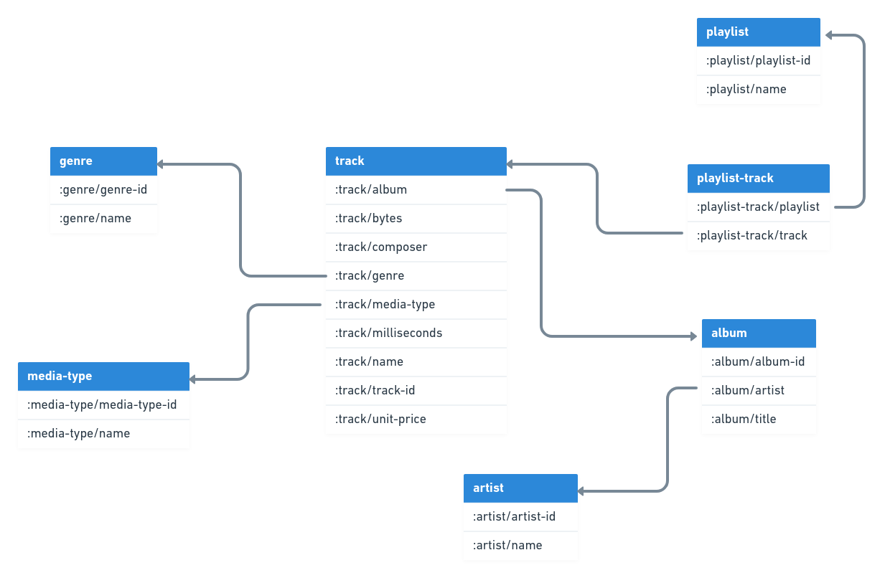

# xtdb-chinook

[XTDB](https://github.com/xtdb/xtdb) is a general-purpose bitemporal database for SQL, Datalog & graph queries.

The [chinook](https://github.com/lerocha/chinook-database) data represents a digital media store including
tracks, albums, artists, playlists and genres. The repository does not include all entities exposed by the
chinook database but only a portion. The exposed entity relationship is shown in the following diagram.



For the following commands to work, you need to have the [Clojure CLI](https://clojure.org/guides/install_clojure) installed.

The repository has essentially three namespaces. [One](src/xtdb_chinook/export.clj) for exporting the data
from the sqlite database to general Clojure map format. You can invoke this via
```bash
$ clj -X xtdb-chinook.export/write-entities :path \"entities.edn\"
```
which will extract the entities into an edn file of your choice. In case you want to ingest the data yourself into XT.
Beware these entities are kept in a rather general format so you they could potentially be ingested in other datalog
backed db's. You would need to remap the `db/id` before ingesting into xt.
```clj
(->> (read-string (slurp "entities.edn"))
     (map #(clojure.set/rename-keys % {:db/id :xt/id})))
```

The [second](src/xtdb_chinook/ingest.clj) namespace ingests the extracted data into a fresh xt node.
```bash
clj -X xtdb-chinook.ingest/ingest
```

## License
